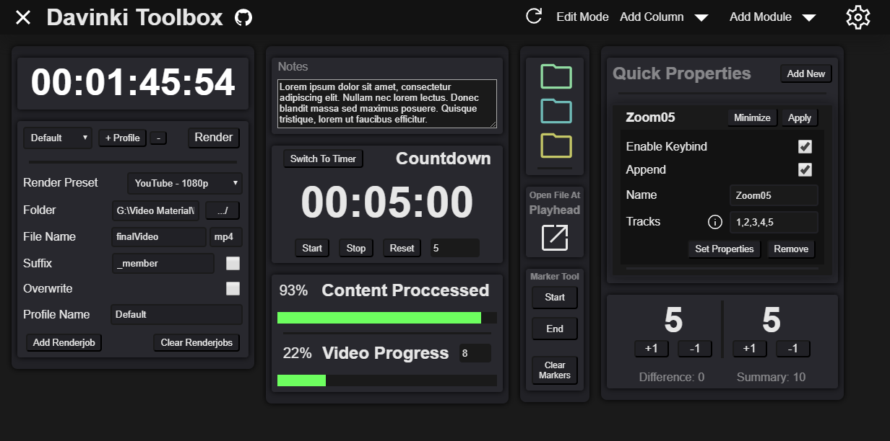

<!-- markdownlint-disable-next-line -->


----

<!-- markdownlint-disable-next-line -->
<p style=text-align:center><b>Studio Version Of Davinci Resolve Is Required</b></p>

>Increase your productivity and workflow with this plugin.  
>This plugin provides a modular toolbox for easy integration with Davinci Resolve.  
>And customize the layout of the plugin to your liking!

This plugin runs with Electron, and uses Svelte as the framework and custom modules files.  
With .svelte files being the modules, it makes it easy to create custom modules.  
And installing modules is a simple drag and drop onto the plugin window.  

This wouldnt be possible without help from Stamsite,  
who helped a ton with feature requests, testing, and general feedback.

This plugin is still in early development, and my personal biggest project yet.  
So there might be some bugs and issues.  
If you find any, please report them in the [Issues](https://github.com/VilleOlof/Toolbox/issues) section.  

----

<!-- markdownlint-disable-next-line -->


----

## Default Modules

- **[Quick Render](./modules/QuickRender.svelte)**  
    A module that makes it quick and easy to render your timeline with just a few clicks.
- **[Quick Properties](./modules/QuickProperties.svelte)**  
    Apply already defined properties to the current video item in the timeline quickly.  
    Useful for quickly zooming in or out, or easily cropping the video.  
- **[Quick Actions](./modules/QuickActions.svelte)**  
    An advanced module for doing mundane tasks quickly  
    Import Media, Add Tracks, Apply LUT and more by clicking one button!  
- **[Image Clipboard](./modules/ImageClipboard.svelte)**  
    Saves the clipboard image to a folder and imports it into the media pool  
- **[Folders](./modules/Folders.svelte)**  
    A small module that allows you to bind folders to colorful icon buttons.  
    This is useful for quickly opening common used folders.  
    Hover over an icon to see the folder path and modify it.  
- **[Marker Tool](./modules/MarkerTool.svelte)**  
    Used to create specific markers used by other modules.  
    Integrates with other modules such as the Quick Render module to render between markers.
- **[Progress Tracker](./modules/ProgressTracker.svelte)**  
    Tracks your progress in the timeline and shows it in a progress bar  
- **[Clamp](./modules/Clamp.svelte)**  
    Used to clamp a video to fit the screen border exactly.  
- **[Timecode](./modules/Timecode.svelte)**  
    A simple module that displays the current timecode of the timeline.  
- **[Open At Playhead](./modules/OpenAtPlayhead.svelte)**  
    Opens the current file at the current playhead position in a new explorer window.  
- **[Counter](./modules/Counter.svelte)**  
    Two counters that can be used to count up or down.  
    They also have a combined sum and difference counter.  
- **[Notes](./modules/Notes.svelte)**  
    Allows you to write notes and save them between sessions (Or not!).  
- **[Timer](./modules/Timer.svelte)**  
    A simple module to keep track of time or a countdown.  
- **[Youtube Chapters](./modules/YoutubeChapters.svelte)**  
    Create Youtube chapter text based on markers in the timeline.  
- **[Import Youtube Members](./modules/ImportYoutubeMembers.svelte)**  
    Import Youtube Members with a CSV file.  
    Create Templates For Each Teir

## **Installation**  

*Latest verified stable Davinci Resolve version this workflow integration works in: 18.5b Beta 1  
Certain modules may not work has intended in other versions*

**Requires: Node.js**  
Windows: Go to [Node.js](https://nodejs.org/en/) and download the latest LTS version.  
MacOS: You can install Node.js with [Homebrew](https://brew.sh/) by running `brew install node` in the terminal.  

Go to the [Releases](https://github.com/VilleOlof/Toolbox/releases/)  
And download the latest installer for your platform.  

Run the installer and if everything went well.  
You should just be able to run the plugin inside Davinci Resolve:  
`DaVinci Resolve > Workspace > Workflow Integrations > Toolbox`  

If you for some reason can't use the installer, you can also install the [plugin manually](#manual-installation).  
**Workflow Integrations are currently not supported on Linux.**

## Custom Modules

**Only install third-party modules from people you trust.**

To create your own custom made modules.  
You can copy the template module in ./modules and rename the file to the name of your module.  
This template module has most of the common in-house imports and code required for a module.  

*Psst! A Dev Version For Creating Modules Easier Can Be Found [Here!](https://github.com/VilleOlof/ToolboxDev)*

Every module consists of a componentID which the plugin uses to identify the module.  
The component HTML should be wrapped in a main tag with the componentID as the id.  
**Note: componentID must be the same as the filename (excluding extension), and can't contain spaces**

```HTML
<main id={componentID}>
    <!-- Here goes your HTML-->
</main>
```

And the module should register itself with the module size (Large or Small) and the componentID.  
This should happen in the `onMount` function.  

```js
import { ModuleHandler } from '../src/Lib/ModuleHandler';
onMount(() => {
    ModuleHandler.RegisterModule(
        componentID, 
        ModuleHandler.ComponentSize.Large, 
        "Module Description"
    );
});
```

These two parts are the only required parts of a module.  
But as mentioned above, you can just copy the template module and rename it.  

If any new dependencies are added alongside a new module, they will need to be added to the ./package.json file.  
And then run `npm install` to install the new dependencies.  
After that, run `npm run build` to build the project with the new dependencies.  

Modules also have full access to the [Davinci Resolve API](./src/Lib/ResolveAPI.d.ts), The file system and other Node.js modules.  

Note: Going to the settings page acts like a soft-refresh.  
Any temporary data that is stored in the module will be lost.  
It will destroy the component and re-create it.  
So you only need to load the settings data once at the start of the module life cycle.  

### Module Settings

With the built in settings page, you can easily create settings for your module.  
The settings page is automatically generated depending on the settings you create.  

To create a setting-  
First call `GlobalSettings.GetInstance(componentID)` to get a setting instance for your module.  
And then `Settings.RegisterSetting()` with the correct parameters.  

Example:

```typescript
// Import the settings classes
import { GlobalSettings, Settings, SettingTypes } from '../src/Lib/Settings';

// Get the settings instance for your module
const settings: Settings = GlobalSettings.GetInstance(componentID); 

// Register a setting and store the value in a variable
const settingValue = settings.RegisterSetting(
    "GreatSettingName",         // Setting Name
    "Useful for being great",   // Setting Description
    55,                         // Default Value
    SettingTypes.Type.Numeric,  // Setting Type
    <SettingTypes.Numeric>{     // Extra Data (Optional)
        Min: 4,
        Max: 84,
        Step: 0.25
    }
);
```

### Module Data

Modules can store data in the plugin.  
This data is stored in the plugin settings file (./Data.json).

To store data, you can use the `Stores/DataStore` namespace.

To store any data, you first need to create a data store.  
By calling `new DataStore(componentID)`.  
And then storing a value by calling `Datastore.Set('DataName', 'Default Value')`.  

Example:

```typescript
// Import the data store namespace
import { DataStore } from '../src/Lib/Stores/DataStore';

// Create a data store
const dataStore: DataStore = new DataStore(componentID);

// Set the data
dataStore.Set('GreatData', 'Great Value');

// Get the data
const greatData: string = dataStore.Get<string>('GreatData');
```

### Common

To make modules even easier to create and more consistent.  
There are some common functions that can be used for various things.  

Like handling IO operations, interacting with Electron, registering keybinds and more.  

Example:

```typescript
// Import the common namespace
import { Common } from '../src/Lib/Common';

const fileContent: string = Common.IO.ReadFile('C:/GreatFile.txt');

Common.Electron.OpenExternalLink('https://www.google.com');

Common.Electron.RegisterShortcut('Shift+Alt+G', () => {
    console.log('Great Shortcut');
});
```

## Docs  

There is no read-made docs, they have to be generated from source.  

Run the following command in the root directory of the project:  

```bash
npm run docs
```

This will generate the docs in the ./docs folder.  
And then you can spin up a local server to view the docs.  
With the following command:

```bash
npm run docs:serve
```

## Custom Theme

If you want to change the theme or colors used in the plugin.  
You can edit the Sass color variables in [_Colors](./src/scss/_Colors.scss) file.  
And then rebuild the project with `npm run build`.

## Manual Installation

**Requires: Node.js**  
Copy the repository to your local machine.  
And put the folder in the following directory:  

Windows: `%ProgramData%\Blackmagic Design\DaVinci Resolve\Support\Workflow Integration Plugins\Toolbox-main`  
MacOS: `~/Library/Application Support/Blackmagic Design/DaVinci Resolve/Workflow Integration Plugins/Toolbox-main`  
*(Note that neither `\Workflow Integration Plugins\` nor `\Toolbox-main` exist, so you will need to create them)*  
*The 'Toolbox-main' folder must be named exactly that for the auto-updater to properly work*  

Run the following command in the root directory of the project:  

```bash  
npm install  
npm run build  
```  

This will install all the dependencies and build the project.  

You will also need to create two files in the root directory of the project.  
`./Data.json`, `./AppSettings.json` and `./Settings.json`  
And both should have the content `{}` inside them.  

And then you can run the plugin inside Davinci Resolve:  
`DaVinci Resolve > Workspace > Workflow Integrations > Toolbox`  
